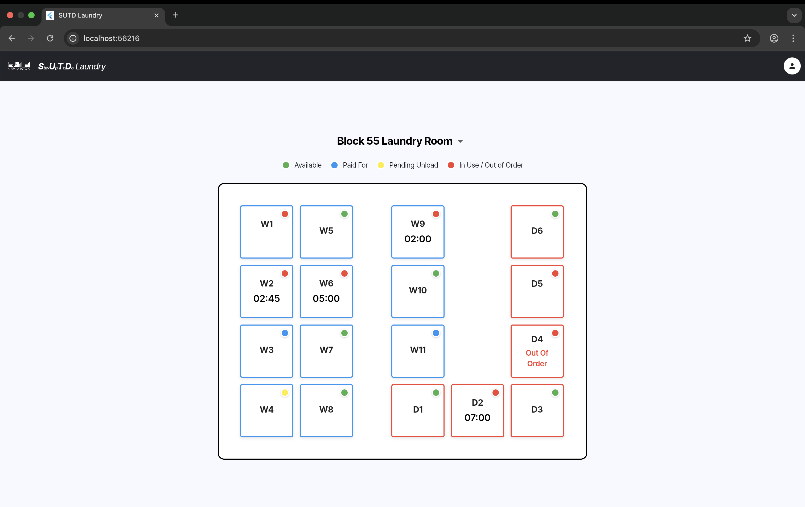
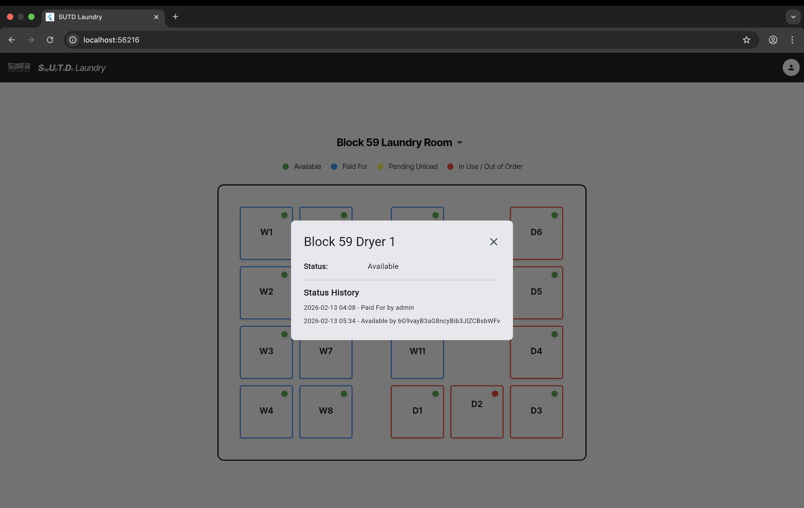
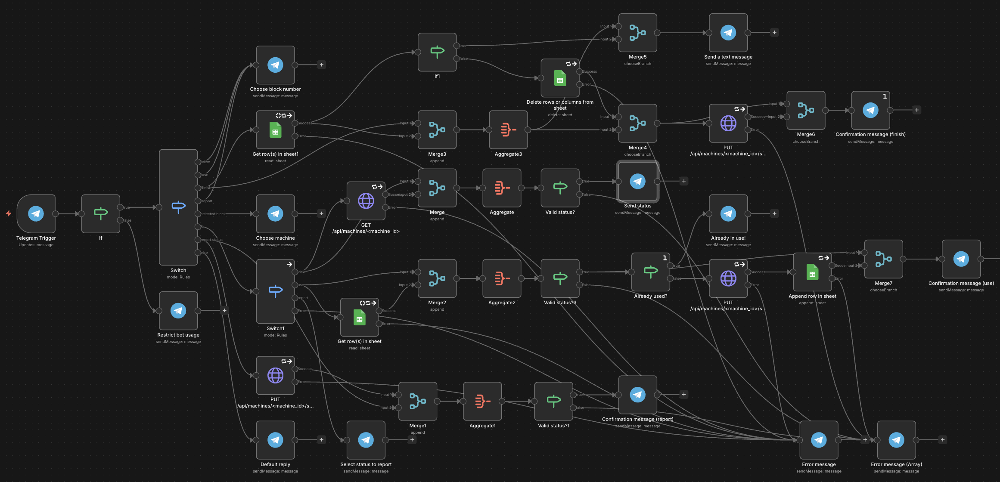

# StayUpToDo-Laundry

<div align="center">


A comprehensive laundry management portal built for SUTD hostel residents to track washer/dryer statuses in blocks 55, 57, and 59 through automated Telegram monitoring and real-time web visualization.

</div>

---

## 🎯 Impetus

Living in SUTD hostels, residents face a common frustration: **wasting time checking laundry room machine availability manually**. Walking to the laundry room only to find all machines occupied is inefficient and annoying. While residents share updates in the "SUTD Family" Telegram group, these messages get buried quickly in active chats, making it hard to track current machine statuses.

**StayUpToDo-Laundry** solves this by:
- 🤖 **Automatically monitoring** Telegram group messages for machine status updates
- 🧠 **Using AI** to parse natural language messages and extract machine information
- 📊 **Visualizing** real-time machine availability in an intuitive web dashboard
- ⚡ **Eliminating** wasted trips to the laundry room

---

## ✨ Features

### 1. **AI-Powered Telegram Bot Integration**
- Monitors "SUTD Family" Telegram group 24/7
- Uses OpenAI GPT-4 to intelligently parse messages like:
  - "Block 55 washer 4 is done!" → Updates 55W4 to available
  - "57W3 not working" → Marks 57W3 as out of order
  - "I paid for dryer 2 in block 59" → Sets 59D2 to paid for
- Automatically filters relevant messages and ignores general chat
- Runs continuously with configurable check intervals

### 2. **Real-Time Web Dashboard**

<div align="center">
  
  
</div>

- 🎨 Beautiful Flutter-based web interface
- 🟢 Color-coded machine status indicators:
  - **Green**: Available
  - **Blue**: Paid For
  - **Yellow**: Pending Unload
  - **Red**: In Use / Out of Order
- 🏢 Organized by block (55, 57, 59) with dropdown navigation
- ⏱️ Real-time countdown for machines in use
- 📱 Responsive design for mobile and desktop
- 🔍 Detailed machine info popups with status history

### 3. **Robust Backend API**
- Flask-RESTful API with comprehensive machine management
- RESTful endpoints for CRUD operations
- Status history tracking for all machines
- Telegram message reference storage
- In-memory storage with easy database migration path
- CORS-enabled for frontend integration

### 4. **n8n Workflow Automation**

<div align="center">
  
</div>

- Self-hosted workflow for custom integrations
- Google Sheets logging for data persistence
- [Telegram bot](https://t.me/stay_up_to_do_laundry_bot) commands for manual updates
- Webhook support for external triggers

---

## 🏗️ Architecture

```
                       ┌──────────────────┐
                       │   OpenAI API     │  ← AI parsing
                       │   (GPT-5)        │
                       └────────┬─────────┘
                                │
                                ▼
┌─────────────────┐    ┌──────────────────┐
│  Telegram Group │───▶│ Telegram Monitor │
│  (Users send    │    │   (Python)       │
│   updates)      │    └────────┬─────────┘
└─────────────────┘             │
                                │
                                ▼
┌─────────────────┐    ┌──────────────────┐
│   n8n Workflow  │    │   Flask API      │◀────┐
│  (Automation &  │    │ (localhost:8000) │     │
│   routing)      │    └────────┬─────────┘     │
└─────────────────┘             │               │
         │                      │               │
         │                 ┌────┴────┐          │
         │                 │  ngrok  │          │
         │                 │ (Public │          │
         └────────────────▶│   URL)  │          │
                           └─────────┘          │
                                                │
                           ┌────────────────────┘
                           │
                           ▼
                  ┌─────────────────┐
                  │ Flutter Web App │  ← Frontend dashboard
                  │ (Direct local   │
                  │  connection)    │
                  └─────────────────┘
```

**Data Flow:**
1. **Telegram Bot** (users) → **Telegram Monitor** (reads messages from Telegram chat)
2. **Telegram Monitor** → **OpenAI API** (parses natural language)
3. **Telegram Monitor** → **Flask API** (updates machine status via HTTP)
4. **n8n Workflow** → **ngrok** → **Flask API** (automation & manual commands)
5. **Flutter Web App** → **Flask API** (fetches machine data directly via localhost)

---

## 🚀 Installation

### Prerequisites

- **Python 3.10+** with pip
- **Flutter SDK** (3.10.0+)
- **ngrok** account and CLI
- **n8n** (self-hosted or cloud)
- **Telegram account** (for bot setup)
- **OpenAI API key**

---

### Step 1: Backend Setup

#### 1.1 Install Python Dependencies

```bash
cd backend
pip install -r requirements.txt
```

#### 1.2 Configure Environment Variables

Copy the example file and add your credentials:

```bash
cp .env.example .env.local
nano .env.local
```

Fill in the required values:

```bash
# Telegram API (get from https://my.telegram.org)
TELEGRAM_API_ID=your_api_id
TELEGRAM_API_HASH=your_api_hash
TELEGRAM_PHONE=+1234567890
TELEGRAM_PASSWORD=your_2fa_password

# Telegram chat to monitor
TELEGRAM_CHAT_ID=-1001234567890

# OpenAI API key
OPENAI_API_KEY=sk-...

# Backend API URL
API_BASE_URL=http://localhost:8000

# Check interval (seconds)
CHECK_INTERVAL=30
```

#### 1.3 Run Flask API

```bash
python3 -m src.app
```

The API will start at `http://localhost:8000`. You should see:

```
Starting StayUpToDo-Laundry Backend Server...
Server running at: http://localhost:8000
API endpoints available at: http://localhost:8000/api/machines
```

---

### Step 2: Expose Backend with ngrok

#### 2.1 Install ngrok

Download and install from [ngrok.com](https://ngrok.com):

```bash
# macOS (using Homebrew)
brew install ngrok/ngrok/ngrok

# Or download directly from https://ngrok.com/download
```

#### 2.2 Activate ngrok Account

Sign up at [ngrok.com](https://ngrok.com). Follow the instructions to configure your auth token.

```bash
ngrok config add-authtoken YOUR_AUTH_TOKEN
```

#### 2.3 Expose Port 8000

In a **new terminal** (keep Flask running):

```bash
ngrok http 8000
```

You'll see output like:

```
Forwarding    https://abc123.ngrok-free.app -> http://localhost:8000
```

**Copy the `https://` URL** - you'll need it for n8n configuration.

---

### Step 3: n8n Workflow Setup

#### 3.1 Install n8n (if not already installed)

```bash
npm install -g n8n
```

#### 3.2 Start n8n

```bash
n8n start
```

Access n8n at `http://localhost:5678`

#### 3.3 Import Workflow

1. Open n8n in your browser
2. Click **"Import from File"**
3. Select `telegram-n8n/SUTD Laundry Bot.json`
4. The workflow will be imported

#### 3.4 Configure Credentials

Replace all credentials in the workflow:

1. **Google Sheets**:
   - Add your Google account credentials
   - Update spreadsheet ID in the Google Sheets nodes

2. **Telegram Bot**:
   - Create a bot via [@BotFather](https://t.me/botfather)
   - Get your bot token
   - Add credentials to Telegram nodes

3. **HTTP Request Nodes**:
   - Replace all `http://localhost:8000` URLs with your ngrok URL
   - Example: `https://abc123.ngrok-free.app/api/machines/55W4/status`

#### 3.5 Activate Workflow

Click **"Active"** toggle in the top-right to enable the workflow.

---

### Step 4: Telegram Monitor

In a **new terminal** (keep Flask and ngrok running):

```bash
cd backend
python3 -m telegram_monitor
```

On first run:
1. Enter the verification code sent to your Telegram app
2. Enter your 2FA password (if enabled)
3. The monitor will start processing messages

You should see:

```
Starting Telegram monitor...
Successfully connected to Telegram
Monitor started. Checking every 30 seconds...
```

---

### Step 5: Frontend Setup

#### 5.1 Install Flutter Dependencies

```bash
cd frontend
flutter pub get
```

#### 5.2 Configure Environment

Create `.env.local` in the frontend directory:

```bash
TELEGRAM_USERNAME=your_telegram_username
```

#### 5.3 Run Flutter App

```bash
flutter run
```

Choose your target device:
- **Chrome** (for web)
- **iOS Simulator**
- **Android Emulator**
- **macOS** (for desktop)

The app will launch and connect to your backend!

---

## 📁 Project Structure

```
StayUpToDo-Laundry/
├── frontend/                    # Flutter web app
│   ├── lib/
│   │   ├── main.dart            # App entry point
│   │   ├── models/              # Data models
│   │   │   └── machine.dart     # Machine model
│   │   ├── screens/             # App screens
│   │   │   └── home_screen.dart # Main dashboard
│   │   ├── services/            # API services
│   │   │   └── machine.dart     # Machine API client
│   │   └── widgets/             # Reusable components
│   │       └── machine.dart     # Machine card widget
│   ├── assets/
│   │   └── images/
│   │       └── sutd-logo.png    # SUTD branding
│   ├── pubspec.yaml             # Flutter dependencies
│   └── .env.local               # Environment variables
│
├── backend/                     # Python Flask API
│   ├── src/
│   │   ├── app.py               # Flask application
│   │   ├── storage.py           # In-memory storage
│   │   ├── models/              # Data models
│   │   │   ├── machine.py       # Machine model
│   │   │   ├── status_history.py
│   │   │   └── telegram_message.py
│   │   ├── resources/           # API endpoints
│   │   │   └── machine.py       # Machine CRUD operations
│   │   └── types/               # Type definitions
│   │       └── enums.py         # Status enums
│   ├── telegram_monitor.py      # AI-powered Telegram monitor
│   ├── requirements.txt         # Python dependencies
│   ├── .env.local               # Backend secrets
│   └── README.md                # Backend documentation
│
├── telegram-n8n/                # n8n workflow automation
│   ├── SUTD Laundry Bot.json    # n8n workflow file
│   └── n8n-workflow.png         # Workflow diagram
│
└── README.md                    # This file
```

---

## 🎮 Usage

### For Residents (End Users)

1. **View Machine Status**:
   - Open the web app
   - Select your block (55, 57, or 59)
   - See color-coded machine availability

2. **Report Status via Telegram**:
   - Send a message in "SUTD Family" group
   - Examples:
     - "55W4 is done"
     - "Block 57 dryer 2 not working"
     - "I just paid for washer 3 in block 59"

3. **Check Details**:
   - Tap any machine to see full details
   - View status history
   - See telegram messages

### For Developers

**API Endpoints**:

```bash
# Get all machines
curl http://localhost:8000/api/machines

# Get machines by block
curl http://localhost:8000/api/machines?block=55

# Update machine status
curl -X PUT http://localhost:8000/api/machines/55W4/status \
  -H "Content-Type: application/json" \
  -d '{"status": "available", "user": "john_doe"}'

# Get machine history
curl http://localhost:8000/api/machines/55W4/history
```

**Status Values**:
- `available` - Machine is free
- `paidFor` - Payment received, not started
- `inUse` - Currently running
- `pendingUnload` - Finished, clothes not removed
- `outOfOrder` - Machine broken

---

## 🔧 Development

### Tech Stack

- **Frontend**: Flutter 3.10+, Dart
- **Backend**: Python 3.10+, Flask, Flask-RESTful, Flask-CORS
- **AI**: OpenAI GPT-4 (via `openai` Python SDK)
- **Telegram**: Telethon (async Telegram client)
- **Automation**: n8n (workflow automation)
- **Infrastructure**: ngrok (tunneling)

---

## 🐛 Troubleshooting

### Backend Issues

**"Missing environment variables"**
- Ensure `.env.local` exists in `backend/` directory
- Check all required variables are set

**"Connection error while updating machine status"**
- Make sure Flask API is running on port 8000
- Check `API_BASE_URL` in `.env.local`

**"OpenAI proxy error"**
- Unset proxy environment variables: `unset HTTP_PROXY HTTPS_PROXY`
- Or upgrade openai library: `pip install --upgrade openai`

### Frontend Issues

**"Failed to load machines"**
- Verify backend is running at `http://localhost:8000`
- Check CORS is enabled in Flask app
- Update `baseUrl` in `frontend/lib/services/machine.dart`

**"Asset not found"**
- Run `flutter clean && flutter pub get`
- Ensure `assets/images/sutd-logo.png` exists

### ngrok Issues

**"Session expired"**
- Re-authenticate: `ngrok config add-authtoken YOUR_TOKEN`

**"Connection refused"**
- Ensure Flask is running on port 8000
- Check firewall settings

---

## 📄 License

This project is created for SUTD hostel residents. See [LICENSE](LICENSE) file for details.

---

## 👥 Acknowledgements

Built with ❤️ for the SUTD community. This project is part of the SUTD Build-for-Campus 2026 Hackathon.
